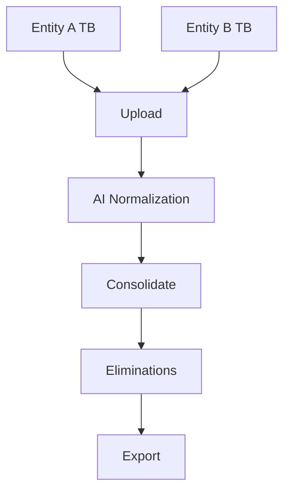

## Overview

Snappytb provides powerful features to streamline your trial balance workflows. You import data, normalize accounts automatically, get AI-powered tax mapping suggestions, consolidate multiple entities, and export ready-to-use reports. These tools help you close books faster without spreadsheets or manual mapping.

<Columns cols={3}>
  <Card title="Automated Normalization" icon="zap" href="#normalization">
    Standardize account names and numbers in seconds.
  </Card>
  <Card title="AI Tax Mapping" icon="brain" href="#tax-mapping">
    Smart IRS category suggestions based on your history.
  </Card>
  <Card title="Multi-Entity Consolidation" icon="layers" href="#consolidation">
    Combine entities seamlessly for consolidated views.
  </Card>
</Columns>

## Automated Trial Balance Normalization

You upload trial balance data in CSV, Excel, or direct API, and Snappytb's AI normalizes it automatically. It standardizes account names like `Cash in Bank` to `1000 - Cash`, detects duplicates, and flags inconsistencies.

<Callout kind="tip">
Use consistent file formats for best results. Supported: CSV with columns `{Account Number}`, `{Account Name}`, `{Debit}`, `{Credit}`.
</Callout>

### Normalization Workflow

<Steps>
  <Step title="Upload File" icon="upload">
    Select your trial balance file.

````bash
# Example CSV structure
Account Number,Account Name,Debit,Credit
1000,Cash in Bank,50000,0
1100,Accounts Receivable,25000,1000
````

  </Step>
  <Step title="Review Suggestions" icon="eye">
    AI proposes normalizations. Accept or edit.

  </Step>
  <Step title="Apply and Save" icon="check-circle">
    Normalized data ready for mapping.

  </Step>
</Steps>

## AI Tax Mapping Suggestions

Snappytb analyzes your firm's history and IRS rules to suggest tax form categories. For example, `Interest Income` maps to Schedule B, Line 1.

<Tabs>
  <Tab title="First-Time Mapping" icon="star">
    New accounts get baseline IRS suggestions.

    <CodeGroup tabs="JavaScript,Python">
```javascript
// API call for mapping suggestions
const response = await fetch('https://api.example.com/v1/mapping/suggest', {
  method: 'POST',
  headers: { 'Authorization': 'Bearer YOUR_TOKEN' },
  body: JSON.stringify({
    accounts: [
      { number: '4100', name: 'Interest Income' }
    ]
  })
});
const suggestions = await response.json();
```
```python
import requests

response = requests.post(
  'https://api.example.com/v1/mapping/suggest',
  headers={'Authorization': 'Bearer YOUR_TOKEN'},
  json={'accounts': [{'number': '4100', 'name': 'Interest Income'}]}
)
suggestions = response.json()
```
    </CodeGroup>
  </Tab>
  <Tab title="History-Based" icon="history">
    Learns from your past mappings for accuracy >95%.
  </Tab>
</Tabs>

<ParamField path="accounts" param-type="array" required="true">
  Array of account objects with `{number}` and `{name}`.
</ParamField>

## Multi-Entity Consolidation Workflows

Combine trial balances from subsidiaries into a consolidated view. Snappytb handles eliminations and currency conversions automatically.



### Consolidation Steps

<Steps>
  <Step title="Add Entities" icon="plus">
    Link multiple entities under one organization.
  </Step>
  <Step title="Map & Normalize" icon="settings">
    Apply mappings across entities.
  </Step>
  <Step title="Review Consolidated TB" icon="bar-chart">
    View combined balances with variances highlighted.
  </Step>
</Steps>

<Expandable title="Advanced Eliminations" default-open="false">
  Configure intercompany eliminations:

  | Elimination Type | Description | Example |
  | ---------------- | ----------- | ------- |
  | Receivables/Payables | Offset intercompany balances | Entity A AR vs Entity B AP |
  | Dividends | Eliminate upstream dividends | Parent-Sub dividends |
  | Investments | Adjust equity investments | Sub equity in parent books |

</Expandable>

## Streaming Performance for Large Datasets

Process datasets with `>10k` rows without lag. Streaming upload provides real-time progress and validation.

<Callout kind="success">
Datasets up to 1M rows supported. Expect `<5s` for 50k rows on standard connections.
</Callout>

## Responsive UI Across Devices

Snappytb's interface adapts to desktops, tablets, and mobiles. Review mappings on-site or in the office seamlessly.

| Device | Optimal Resolution | Key Features |
| ------ | ------------------ | ------------ |
| Desktop | `1920x1080` | Full dashboard, multi-panel view |
| Tablet | `1024x768` | Collapsible panels, touch gestures |
| Mobile | `<600px` width | Single-column, quick actions |

<Columns cols={2}>
  <Card title="Get Started" icon="rocket" href="/quickstart">
    Follow the quickstart guide.
  </Card>
  <Card title="API Reference" icon="code" href="/authentication">
    Integrate programmatically.
  </Card>
</Columns>