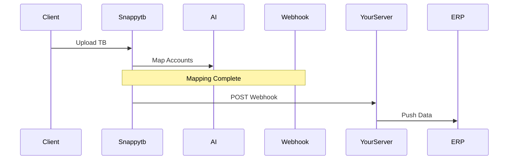

## Overview

Snappytb supports flexible integrations to fit your accounting workflow. Export mapped trial balances to CSV, Excel, or PDF for easy sharing and reporting. Import data from various trial balance sources, and connect with popular accounting software like QuickBooks and Xero. Set up automated workflows using webhooks for hands-free processing.

<Callout kind="info">
Review your export settings in the dashboard at `https://dashboard.example.com` to ensure compliance with IRS categories.
</Callout>

## Export Formats

Choose from multiple export formats directly from the Snappytb dashboard. Each format preserves your AI-mapped IRS categories and supports custom filters.

<Tabs default-tab="2">
  <Tab title="CSV" icon="file-text">
    Export lightweight CSV files for integration with spreadsheets or other tools.

    <Steps>
      <Step title="Select Data" icon="search">
        Navigate to the Mapped Balances tab and apply filters.
      </Step>
      <Step title="Export" icon="download">
        Click Export > CSV. Download starts immediately.
      </Step>
    </Steps>

    ```csv
    Account,IRS_Category,Amount,Normalized_Name
    1000,Cash,15000.00,"Cash - Operating"
    2000,Accounts_Receivable,25000.50,"A/R - Clients"
    ```
  </Tab>
  <Tab title="Excel" icon="file-spreadsheet">
    Generate Excel files (.xlsx) with formulas and pivot tables pre-configured.

    ```javascript
    // Example: Process exported Excel in Node.js
    const XLSX = require('xlsx');
    const workbook = XLSX.readFile('trial-balance.xlsx');
    const sheet = workbook.Sheets[workbook.SheetNames[0]];
    const data = XLSX.utils.sheet_to_json(sheet);
    console.log(data[0]); // { Account: '1000', IRS_Category: 'Cash', Amount: 15000 }
    ```
  </Tab>
  <Tab title="PDF" icon="file">
    Create professional PDF reports ready for client delivery or audits.

    <Callout kind="tip">
      PDFs include your firm logo and custom footers—configure in Settings.
    </Callout>
  </Tab>
</Tabs>

## Import Trial Balances

Import data from CSV, Excel, or direct API connections. Snappytb's AI normalizes accounts automatically.

<Steps>
  <Step title="Prepare File" icon="upload">
    Ensure your file has columns: `Account`, `Amount`, `Description`.
  </Step>
  <Step title="Upload" icon="cloud-upload">
    Go to Imports > Upload File. Drag and drop or select.
  </Step>
  <Step title="Map & Review" icon="settings">
    Review AI suggestions, then process.
  </Step>
</Steps>

<CodeGroup tabs="CSV,Excel">
```csv
Account,Debit,Credit,Description
1000,15000,,Cash Balance
2000,,25000.50,A/R Invoice #123
```
```javascript
// Excel import via API
const formData = new FormData();
formData.append('file', excelFile);
fetch('https://api.example.com/v1/imports', {
  method: 'POST',
  headers: { 'Authorization': 'Bearer YOUR_TOKEN' },
  body: formData
});
```
</CodeGroup>

## Accounting Software Compatibility

Snappytb integrates seamlessly with leading accounting platforms.

<Columns cols={3}>
  <Card title="QuickBooks" icon="package" href="https://quickbooks.intuit.com" target="_blank">
    Export directly to QuickBooks Online/Desktop via CSV or API.
  </Card>
  <Card title="Xero" icon="shield" href="https://xero.com" target="_blank">
    Automated mapping for Xero trial balances.
  </Card>
  <Card title="Sage" icon="database" href="https://sage.com" target="_blank">
    Compatible with Sage 50/Intacct exports.
  </Card>
</Columns>

| Software       | Import Support | Export Support | API Integration |
|----------------|----------------|----------------|-----------------|
| QuickBooks     | CSV, Excel     | CSV, Journal   | Yes             |
| Xero           | CSV, API       | Excel, PDF     | Yes             |
| Sage           | CSV, Excel     | CSV            | Partial         |

## Automated Export Workflows

Set up webhooks to trigger exports on events like mapping completion.



<Expandable title="Webhook Configuration" default-open="true">
Configure in Dashboard > Integrations > Webhooks.

<ParamField header="X-Webhook-Signature" param-type="string" required="true">
  HMAC signature for verification.
</ParamField>

```javascript
// Verify webhook signature
const crypto = require('crypto');
const signature = req.headers['x-webhook-signature'];
const hash = crypto.createHmac('sha256', 'YOUR_WEBHOOK_SECRET')
  .update(JSON.stringify(req.body))
  .digest('hex');
```

Example payload:

```json
{
  "event": "mapping.complete",
  "trial_balance_id": "tb_12345",
  "export_url": "https://api.example.com/v1/exports/tb_12345.csv"
}
```
</Expandable>

<Callout kind="success">
Test integrations in sandbox mode first to avoid production data issues.
</Callout>